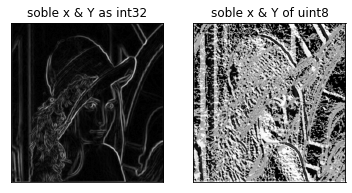
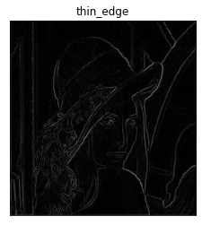
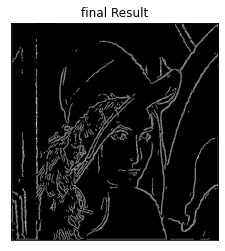

# 03_canny_edge_detection
 ## Goal:
 To implement the canny edge detector from the scratch. 
 To understand the variation in result with different data types like uint8, int32 and float16
 
 ## Step 1: Gaussian blurr
 Apply the gaussian blur to the image (Result has sigma =1.4 and ksize = 5)
 Before applying gaussian filter, make sure the image is in grayscale format.
 
 
 
 ## step 2: Sobel filter
 Applying the sobel filter in x & y direction and then combingin the gradient to see the end results. In this stage the soble filters were applied on two different datatypes viz., uint8 and int32. The results with the int32 are found to be better and accurate for further calculations. This is because of the [code line 47](cannyDetector_class.py) generates the output in float 16 dtype. This dtype is not supported with plt.imshow. So, to getthis matrix in an appropriate format, it is multiplied by 255. This multilpication also changes the original results after applying the sobel filters. Therefore, getting the filtered images in the float 64 data type is always better as done in the [code line 41](cannyDetector_class.py).
 
 
 
 ## Step 3: Non Maximum suppresion
 For every pixle in the image, its front are rear pixle along the edge direction (theta) are found. Then if thes front or rear pixle is more bright than the actual pixle, only then the pixel intensity is retained otherwise it is set to zero. This generates the this edge.
 
 
 
 ## step 4: Thresholding and hysteresis

 Divide the thin_edge image matrix in the strong, weak and intermediate sections. Set all strong pixles to 255, set all weak pixels to 0.
 For intermediate pixles, set only those pixle as strong having a brighter neighbour pixle. Having a brighter neighbour pixle means that the pixle is in continuation with the strong edge.
 
  
 
 ## References
[canny-edge-detection-step-by-step](https://towardsdatascience.com/canny-edge-detection-step-by-step-in-python-computer-vision-b49c3a2d8123)
